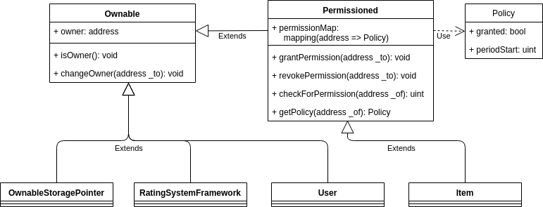
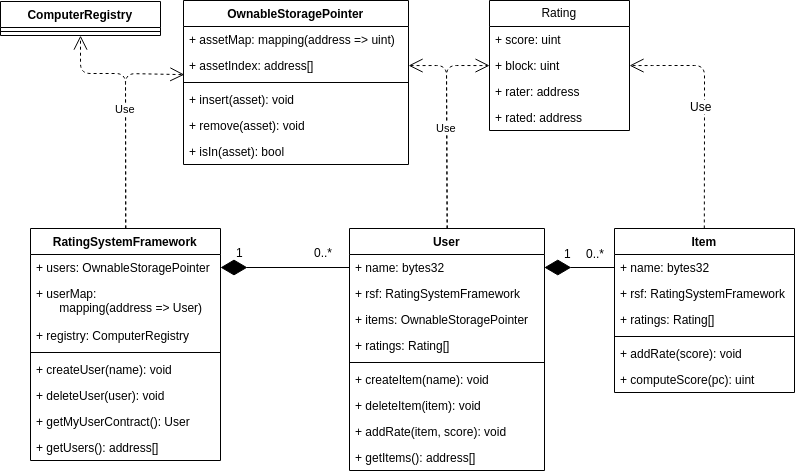
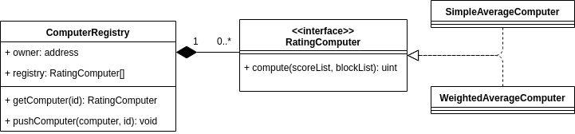

# Rating System

Project for the final thesis at University of Pisa, master degree in Computer Science.

Build a set of smart contracts to implement the logic and the record-keepeing of the core information concerning online reputation systems (or Recommender Systems).

The interesting information should be suitable to be:

- **Immutable**: You should not remove / modify an existing information;
- **Transparent**: You should hide somehow such information;
- **Ordered**: Such information should follow an order.

After an assessment, the most suitable information is the **Rating** (or Review) which charaterize such reputation systems.

The smart contracts, implemented in Solidity language, provide the logic for the modeling and storage of such information.

The nomenclature of the core contracts follows the nomenclature used in this article: [Recommender Systems: Introduction and Challenges](https://link.springer.com/chapter/10.1007/978-1-4899-7637-6_1).

## Interfaces Overview

High level contracts

## Class overview

Core contracts

## ComputerRegistry and RatingComputer

Contracts implementing rating functions for the computation of the score of an Item

